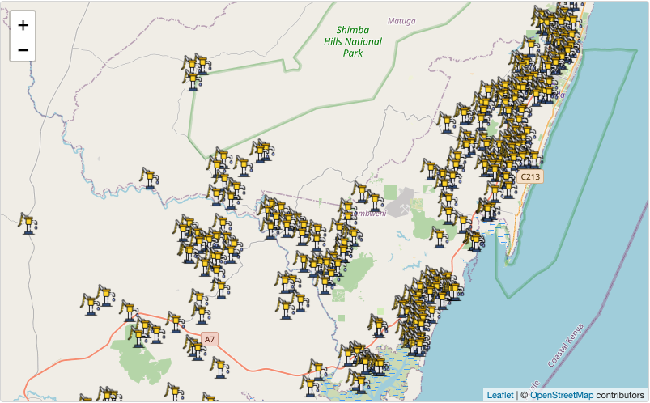

<!-- README.md is generated from README.Rmd. Please edit that file -->

```{r, include = FALSE}
knitr::opts_chunk$set(
  collapse = TRUE,
  comment = "#>",
  fig.path = "man/figures/README-",
  out.width = "100%"
)
```

# waterpumpkwale

<!-- badges: start -->

[](https://creativecommons.org/licenses/by/4.0/)
[](https://github.com/openwashdata/waterpumpkwale/actions/workflows/R-CMD-check.yaml)
[](https://zenodo.org/badge/latestdoi/679250421)
<!-- badges: end -->

The goal of `waterpumpkwale` is to provide datasets for monitoring
weekly volume of hand pumps in Kwale, Kenya. This package contains
valuable information of geo-locations of hand pumps in Kwale as well as
monitoring data recorded in year 2014 and 2015. The data is collected
part of the project [UPGro](https://upgro.org) (Unlocking the Potential
of Groundwater for the Poor) which aimed to improve the evidence and
understanding of groundwater across Sub-Saharan Africa to help tackle
poverty.

## Installation

You can install the development version of waterpumpkwale from
[GitHub](https://github.com/waterpumpkwale) with:

``` r
# install.packages("devtools")
devtools::install_github("openwashdata/waterpumpkwale")
```

Alternatively, you can download the individual datasets as CSV or XLSX
file from the table below.

| dataset       | CSV                                                                                                    | XLSX                                                                                                     |
|------------------|---------------------------|---------------------------|
| location      | [Download CSV](https://github.com/openwashdata/waterpumpkwale/raw/main/inst/extdata/location.csv)      | [Download XLSX](https://github.com/openwashdata/waterpumpkwale/raw/main/inst/extdata/location.xlsx)      |
| weeklyvol2014 | [Download CSV](https://github.com/openwashdata/waterpumpkwale/raw/main/inst/extdata/weeklyvol2014.csv) | [Download XLSX](https://github.com/openwashdata/waterpumpkwale/raw/main/inst/extdata/weeklyvol2014.xlsx) |
| weeklyvol2015 | [Download CSV](https://github.com/openwashdata/waterpumpkwale/raw/main/inst/extdata/weeklyvol2015.csv) | [Download XLSX](https://github.com/openwashdata/waterpumpkwale/raw/main/inst/extdata/weeklyvol2015.xlsx) |

## Introduction

This dataset contains a summary of the weekly volumetric output of pumps
monitored using Smart Handpump sensors for 2014 and 2015 in Kwale,
Kenya.[^1][^2]

[^1]: Grants that permitted the data collection include: Groundwater
    Risk Management for Growth and Development project (NE/M008894/1)
    funded by NERC/ESRC/DFID's UPGro programme; New mobile citizens and
    waterpoint sustainability in rural Africa (ES/J018120/1) ESRC-DFID;
    Groundwater Risks and Institutional Responses for Poverty Reduction
    in Rural Africa (NE/L001950/1) funded by NERC/ESRC/DFID's UPGro
    programme.

[^2]: More information of the data sources:
    <https://metadata.bgs.ac.uk/geonetwork/srv/eng/catalog.search#/metadata/9ed6c5d2-124b-50ed-e054-002128a47908>,
    <https://webapps.bgs.ac.uk/services/ngdc/accessions/index.html?simpleText=upgro>

Notes:

1.  The accuracy of these volume figures should be considered to be +/-
    20%.
2.  The dataset has gaps due to variable signal, and some attrition due
    to damage and vandalism.
3.  Not all pumps in the study area were under monitoring.

## Data

The package provides access to three datasets `location`,
`weeklyvol2014`, and `weeklyvol2015`.

```{r}
library(waterpumpkwale)
```

### `location` data

The `location` data set has 6 variables and 299 observations. They
record 299 hand pumps location information. For an overview of the
variable names, see the following table.

```{r, echo=FALSE, message=FALSE}
readr::read_csv("data-raw/dictionary.csv") |>
  dplyr::filter(file_name == "location.rda") |>
  dplyr::select(variable_name:description) |> 
  knitr::kable()
```

### `weeklyvol2014` and `weeklyvol2015` data

The `weeklyvol2014` data set has 53 variables and 324 observations. The
`weeklyvol2015` data set has 53 variables and 297 observations.

These two datasets follow the same structure and we here use
`weeklyvol2014` as an illustration. For an overview of the variable
names, see the following table.

```{r echo=FALSE, message=FALSE}
readr::read_csv("data-raw/dictionary.csv") |>
  dplyr::filter(file_name == "weeklyvol2014.rda") |>
  dplyr::select(variable_name:description) |> 
  knitr::kable()
```

## Example

We can have a look where the hand pumps locate in Kwale using the
dataset `location`. For more data exploration, you may check out [a
detailed example here]().

```{r eval=FALSE}
library(leaflet)
# customize marker icon 
handpumpicon <- makeIcon(
  iconUrl = "https://cdn-icons-png.flaticon.com/512/5984/5984318.png",
  iconWidth = 30, iconHeight = 30
)

# Display an interactive map
leaflet(options = leafletOptions(crs = leafletCRS(proj4def = "WGS84"))) |>
  addProviderTiles("OpenStreetMap") |>
  addMarkers(
    data = location,
    lng = ~`long_wgs84`,
    lat = ~`lat_wgs84`,
    popup = ~pumpid,
    label = ~`description`,
    icon = handpumpicon
)
```



## License

Data are available as
[CC-BY](https://github.com/openwashdata/waterpumpkwale/blob/main/LICENSE.md).

## Citation

If you use the data or the package, consider to cite this package with
the following information to give credits for authors of the dataset!

```{r}
citation("waterpumpkwale")
```

### Related References

[1] P. Thomson, R. Hope, and T. Foster, "GSM-enabled remote monitoring
of rural handpumps: a proof-of-concept study," Journal of
Hydroinformatics, vol. 14, no. 4, pp. 829--839, 05 2012. [Online].
Available: <https://doi.org/10.2166/hydro.2012.183>

[2] Behar, J., Guazzi, A., Jorge, J., Laranjeira, S., Maraci, M.A.,
Papastylianou, T., Thomson, P., Clifford, G.D. and Hope, R.A., 2013.
Software architecture to monitor handpump performance in rural Kenya. In
Proceedings of the 12th International Conference on Social Implications
of Computers in Developing Countries, Ochos Rios, Jamaica. pp. 978 (Vol.
991).
